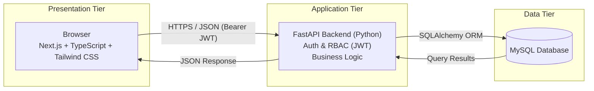
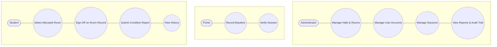
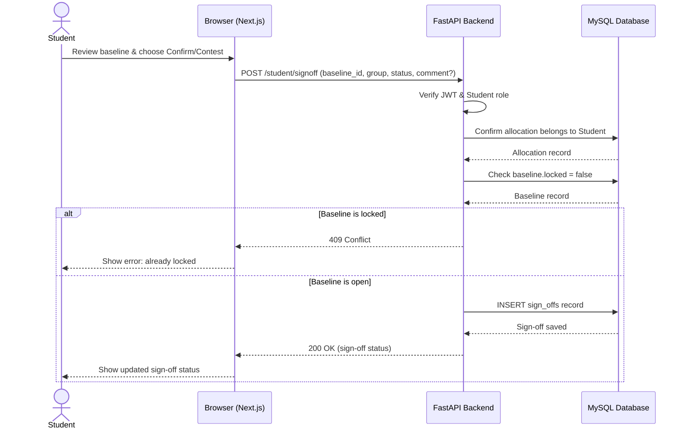
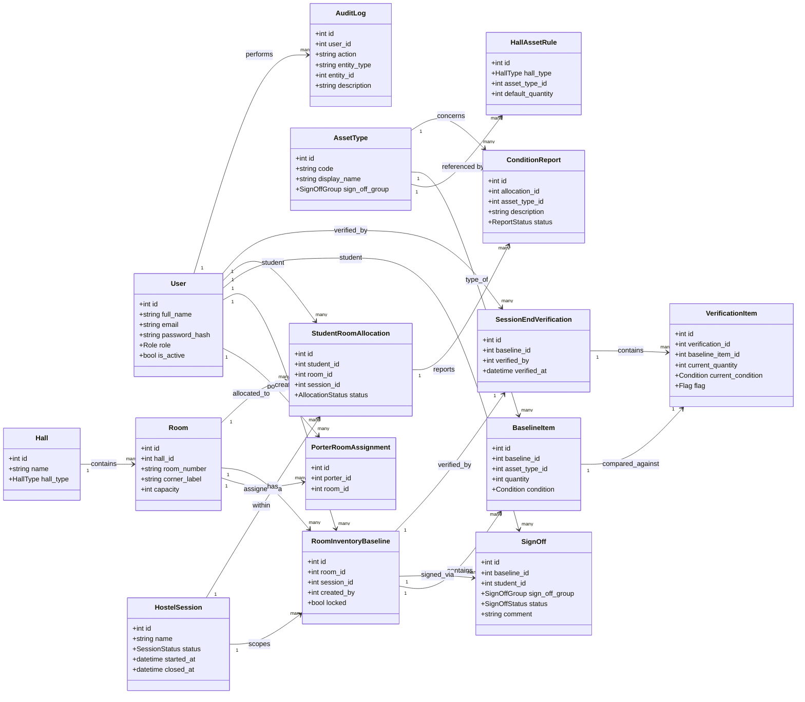
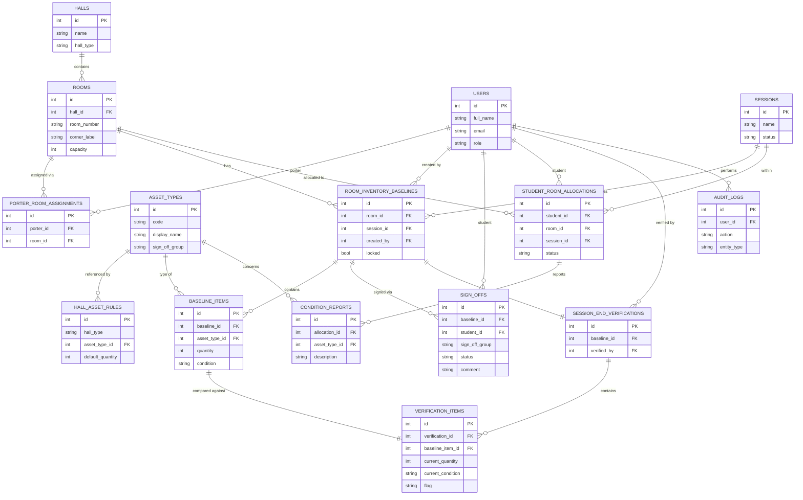
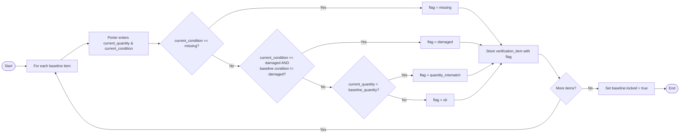
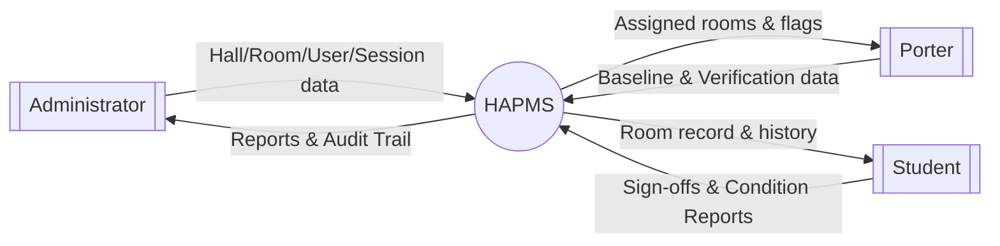
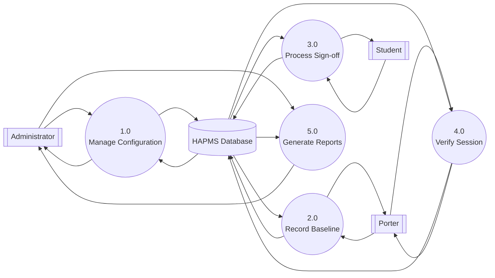

# Chapter 3 Diagrams — Mermaid Source

How to use: in draw.io, go to **Extras → Edit Diagram**, paste one block's code (without the ` ```mermaid ` fence lines) into the panel, and confirm. Or, in newer draw.io versions, **Arrange panel → Mermaid** offers a dedicated import box. Each diagram below is self-contained — import one at a time.

Two notes on fidelity: Mermaid has no native UML **use case** notation or **DFD** notation, so Figures 3.3, 3.9, and 3.10 are built from Mermaid's flowchart primitives (circles for processes/use cases, stadium/rectangle shapes for actors/external entities) rather than textbook UML/Gozinto symbols. If your supervisor expects strict UML use-case ellipses or Gane-Sarson DFD shapes, re-draw those two shapes manually in draw.io after import — the structure and labels are already correct, only the shape style would need adjusting. Everything else (sequence, class, ER, flowcharts) uses Mermaid's native diagram types and will import faithfully.

**On page orientation**: Figures 3.1, 3.2, 3.3, 3.4, 3.8, 3.9, and 3.10 are now laid out as wide, short bands (roughly 5:1 to 29:1 width:height) — insert these on a landscape-oriented page. Figures 3.6 (Class Diagram) and 3.7 (ER Diagram) stay closer to square/tall (~1.1–1.6:1) even after switching direction, because they each carry 15 entities with multiple attributes — that's a content-volume issue, not something orientation alone fixes without dropping detail; a landscape page still gives them more usable width than portrait. Figure 3.5 (Sequence Diagram) is conventionally vertical by notation (time flows top-to-bottom) and is a reasonable size as-is.

---

## Figure 3.1: Diagram of the Incremental Development Model

```mermaid
flowchart LR
    I1["Increment 1<br/>Foundations &amp; Data Layer"] --> I2["Increment 2<br/>Authentication &amp; RBAC"] --> I3["Increment 3<br/>Administrator Configuration"] --> I4["Increment 4<br/>Porter Baseline Entry"] --> I5["Increment 5<br/>Student Onboarding &amp; Room View"] --> I6["Increment 6<br/>Student Sign-off &amp; Dispute Handling"] --> I7["Increment 7<br/>Condition Reports &amp; History"] --> I8["Increment 8<br/>Session-End Verification &amp; Locking"] --> I9["Increment 9<br/>Admin Reporting &amp; Audit Trail"] --> I10["Increment 10<br/>Pending-Action Indicators"] --> I11["Increment 11<br/>Cross-Role Hardening"] --> I12["Increment 12<br/>Delivery"]
```



---

## Figure 3.2: System Architecture Diagram



---

## Figure 3.3: Use Case Diagram



---

## Figure 3.4: Activity Diagram (Room Lifecycle)

```mermaid
flowchart LR
    Start([Start]) --> A[Administrator creates Hall &amp; Room]
    A --> B[Administrator opens Hostel Session]
    B --> C[Porter records Room Inventory Baseline]
    C --> D[Student allocated room via Kofa]
    D --> E[Student reviews baseline]
    E --> F{Student agrees<br/>with record?}
    F -- Yes --> G[Student signs off: Confirmed]
    F -- No --> H[Student signs off: Contested<br/>+ Dispute Comment]
    G --> I{Condition changes<br/>during stay?}
    H --> I
    I -- Yes --> J[Student submits Condition Report]
    I -- No --> K[Session continues]
    J --> K
    K --> L[Porter performs Session-End Verification]
    L --> M[System computes discrepancy flags]
    M --> N[Baseline &amp; sign-offs locked]
    N --> End([End])
```



---

## Figure 3.5: Sequence Diagram (Student Sign-off)



---

## Figure 3.6: Class Diagram



---

## Figure 3.7: Entity-Relationship Diagram



---

## Figure 3.8: Session-End Verification Flowchart



---

## Figure 3.9: Data Flow Diagram (Level 0 — Context Diagram)



---

## Figure 3.10: Data Flow Diagram (Level 1)


